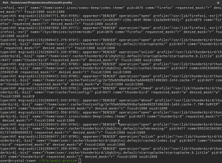
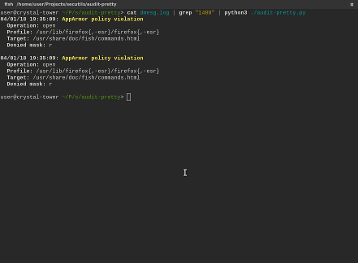

[WIP] audit-pretty
====================

[Linux Auditing System ](https://linux.dit.net/man/8/auditd) log files pretty printer.

 


Installation
------------------------

You can run script directly from repository: `python3 -m audit_pretty ARGS...`
or install it to system directory: `pip3 install audit_pretty`.

Usage
------------------------

You need only Python 3 for this script to work.

```
sudo dmesg | audit-pretty
```
```
sudo cat /var/log/audit/audit.log | audit-pretty
```

It works correctly with `dmesg -w` so you can watch live log in readable
format!
```
sudo dmesg -w | audit-pretty
```

There are bunch of useful options you may want to use, check out `audit-pretty -h`!

Room for improvement
------------------------

- [x] Don't use colors (`--no-colors`)
- [x] Filter by time (`--since`, `--until`)
- [ ] Handle more than just AppArmor violations
- [x] Verbose option to include more info (`-v`, `--verbose`)
- [x] Filter message types (`-e`, `--exclude`, `--only`)
- [x] Merge repeated messages (useful for policy debugging) (`--merge`)

